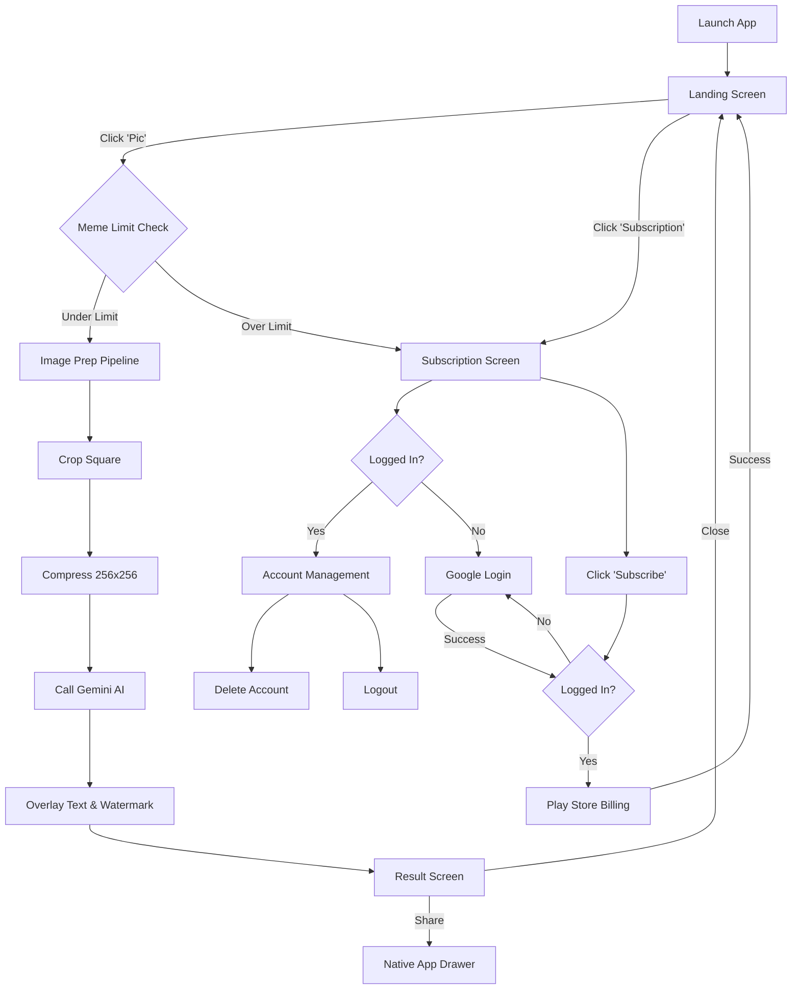

# Working Flow: MemeGen AI

This document details the step-by-step logic flow of the MemeGen AI application, formalizing the **Action Diagram**.

## 1. High-Level User Journey (Mermaid)

## 2. Technical Step Definitions

### 2.1 Meme Limit Check
- **Logic**: Verify if `current_memes_today < 3`.
- **Guest Users**: Track usage via local storage (indexed by date) and IP address.
- **Premium Users**: If `is_subscriber == true`, bypass check.
- **Enforcement**: If limit reached, auto-redirect to **Subscription Screen**.

### 2.2 Image Prep Pipeline
1. **Aspect Ratio**: Force center-crop to 1:1 (Square).
2. **Resolution**: Downscale to `256 x 256` pixels.
3. **Format**: Convert to JPEG/WebP with 80% quality to minimize upload payload.

### 2.3 Gemini AI Integration
- **Input**: The processed image bytes.
- **Prompt**: "Generate a funny, viral meme caption for this image. Keep it under 15 words."
- **Output**: JSON containing the generated `caption`.

### 2.4 Output Processing
- **Font**: Use a high-contrast meme font (e.g., Impact or Montserrat Bold).
- **Watermark**: Fixed text "MemeGen.ai" at the bottom right corner (50% opacity).
- **Positioning**: Top/Bottom text overlay based on caption length.

### 2.5 Subscription & Billing
- **Platform**: Google Play Billing Library.
- **State Change**: On receipt validation, immediately update `user.is_subscriber = true` in local state/database.
- **Post-Payment**: Return user to the **Landing Screen** with a success toast.

## 3. Edge Cases & Error Handling

| Scenario | Action | UI Response |
|---|---|---|
| **Gemini Timeout** | Retry once, then fail | "AI is sleepy. Try again?" |
| **Upload Failure** | Check connectivity | "Check your internet connection." |
| **Payment Cancelled** | Stay on Subscription Screen | No change. |
| **Account Deleted** | Wipe local data & Revoke Google Token | Redirect to Landing (new state). |
